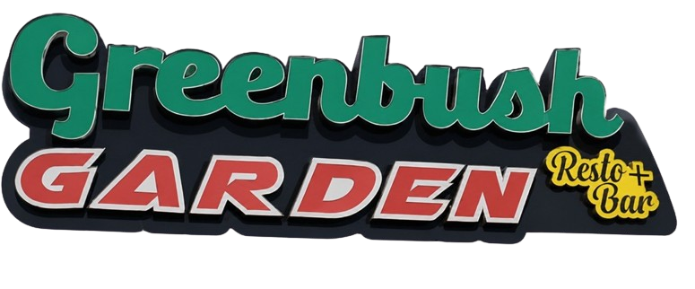

# 🌿 Green Bush Garden Website

A modern, elegant, and responsive restaurant website built with **Next.js**, **React**, **TypeScript**, and **Tailwind CSS**. The website showcases Green Bush Garden's menu, gallery, events, and reservation system with a luxury design inspired by premium restaurant websites.



---

## ✨ Features

- 🌿 Modern luxury restaurant design
- 📱 Fully responsive (Mobile, Tablet & Desktop)
- 🎬 Smooth animations with Framer Motion
- 🖼️ Beautiful image gallery
- 🍽️ Elegant menu section
- 📅 Reservation popup form
- 🎉 Events section
- 📞 WhatsApp & Call buttons
- 🌙 Glassmorphism navigation bar
- ⚡ Fast performance with Next.js Image Optimization

---

## 🛠️ Built With

- Next.js 15
- React 19
- TypeScript
- Tailwind CSS 4
- Framer Motion
- Lucide React Icons

---

## 📂 Project Structure

```text
app/
│
├── page.tsx
├── layout.tsx
└── globals.css

components/
│
├── home/
│   ├── Hero.tsx
│   ├── About.tsx
│   ├── FeaturedMenu.tsx
│   ├── Gallery.tsx
│   ├── Events.tsx
│   └── Reservation.tsx
│
├── layout/
│   └── Navbar.tsx
│
└── ui/
    ├── Container.tsx
    ├── MenuCard.tsx
    └── Button.tsx

public/
│
├── images/
│   ├── hero.jpg
│   ├── logo.png
│   ├── about1.jpg
│   ├── about2.jpg
│   ├── about3.jpg
│   ├── menu1.jpg
│   ├── menu2.jpg
│   ├── menu3.jpg
│   ├── menu4.jpg
│   ├── menu5.jpg
│   └── menu6.jpg
```

---

## 🚀 Getting Started

### Clone the repository

```bash
git clone https://github.com/yourusername/green-bush-garden.git
```

### Navigate into the project

```bash
cd green-bush-garden
```

### Install dependencies

```bash
npm install
```

### Run the development server

```bash
npm run dev
```

Open your browser and visit:

```
http://localhost:3000
```

---

## 📦 Build for Production

```bash
npm run build
```

Start the production server:

```bash
npm start
```

---

## 🎨 Design

### Colors

| Color | Hex |
|--------|-----|
| Primary Green | `#166534` |
| Dark Green | `#14532D` |
| Cream Background | `#FBF8F2` |
| Gold Accent | `#C8A95A` |
| White | `#FFFFFF` |

---

## 📱 Responsive Design

- Mobile First
- Tablet Optimized
- Desktop Optimized
- Large Screen Support

---

## 📸 Image Optimization

All images use the Next.js `<Image />` component for:

- Automatic optimization
- Lazy loading
- Responsive sizing
- Better performance

---

## 📋 Future Improvements

- Menu filtering by category
- Online reservation backend
- Customer testimonials
- Google Maps integration
- Dark mode
- Admin dashboard
- CMS integration
- Online ordering
- Multi-language support

---

## 👨‍💻 Developer

Developed by **Samuel Mengistu**

GitHub: https://github.com/yourusername

---

## 📄 License

This project is licensed under the MIT License.

---

### 🌿 Green Bush Garden

**Nature • Great Food • Beautiful Memories**